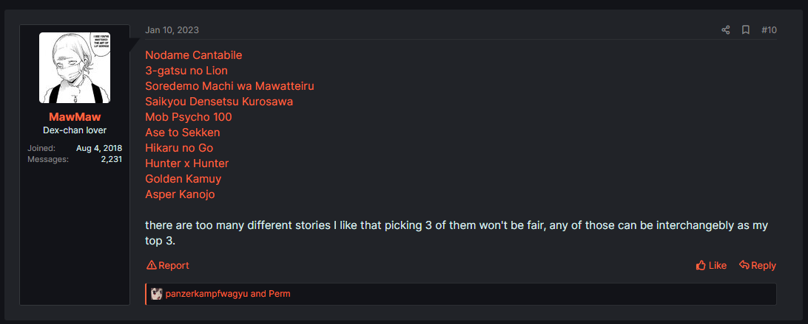

# Forums

Imagine, you seeing a list of manga in some MangaDex forums thread and you want to download them all. 
Surely you copy each URLs from the thread and paste them into mangadex-downloader. 
You must be tired copy paste them all right ? and you wasted your time doing that.

Worry not, you can download all of them directly from mangadex-downloader itself !

**Wow, it so cool. How ?**

Just copy the forum thread url and paste it into mangadex-downloader

```sh
mangadex-dl "https://forums.mangadex.org/threads/whats-your-top-3-manga.1082493/"
```

That's it, you will be prompted to select which manga, chapter, or list you wanna download. 
If you don't wanna be prompted and just wanna download them all, you can use `--input-pos` option.

```sh
# "*" means all
mangadex-dl "https://forums.mangadex.org/threads/whats-your-top-3-manga.1082493/" --input-pos "*"
```

## Specific post in a forum thread

mangadex-downloader can find MangaDex URLs to a specific post in forum thread 
if the URL containing post-id. Let me give you an example:

Let's say you want to download list of manga from this post only.



Move your mouse to number sign (#10) on top right corner, 
right click on your mouse, copy link address and paste it to mangadex-downloader.

```sh
mangadex-dl "https://forums.mangadex.org/threads/whats-your-top-3-manga.1082493/#post-16636005"
```

Notice there is `#post-16636005` at the end of URL ? 
Those are called post-id in MangaDex forums. 
mangadex-downloader will only find MangaDex URLs on that post only, not the entire thread.

## Legacy MangaDex forum thread URL

You can use old MangaDex forum thread URL to mangadex-downloader. 
Just copy the URL, paste it and run it !

```sh
mangadex-dl "https://mangadex.org/thread/430211"
```

## Note

mangadex-downloader only shows results if the thread containing valid MangaDex urls.
