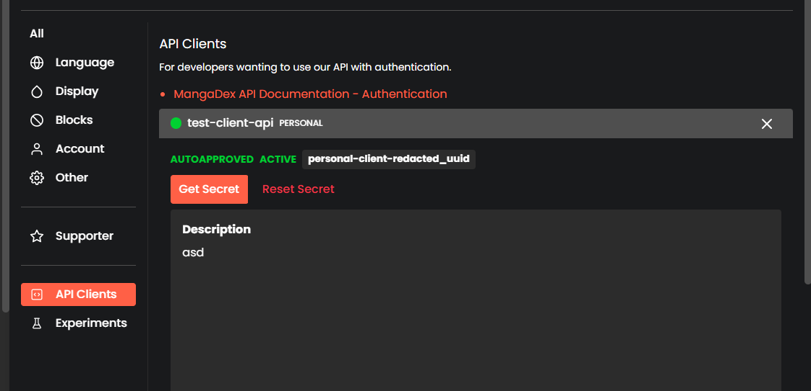

# OAuth (New Authentication System)

MangaDex are now switching to new authentication system called OAuth 2.0 and because of this
the legacy authentication may be deprecated soon.

## The process

Previously, when you login to mangadex-downloader you will be prompted to input 
username and password, then the application will send request to MangaDex server 
that you're trying to login into your account via mangadex-downloader. After that, 
MangaDex server acknowledge the request and then send the authentication tokens (access token and refresh token), 
this token (access token) is used to send request to restricted endpoints that require login, 
the token is expired within 15 minutes after you successfully logged in. However, we have another token called 
refresh token that is to refresh access token when it's expired. mangadex-downloader will send refresh access token request 
to MangaDex server using refresh token and then we get the new access token. The refresh token (to my knowledge) is expired
within 1 month. So if you're using authentication cache in mangadex-downloader you still can login to the app via refresh token

Now, MangaDex has this new authentication system called OAuth 2.0 
(if you don't know what that is, search in google or other search engine), in short it's more secure authentication system.

If you're trying to login in mangadex-downloader using new authentication system, you will be prompted 4 inputs:

- username
- password
- API Client ID
- API Client Secret

Example usage:

```sh
mangadex-dl "URL" --login --login-method "oauth2" --login-username "username" --login-password "password" --login-api-id "API Client ID" --login-api-secret "API Client Secret"
```

```{note}
You must set `--login-method` to `oauth2` to use new authentication system, otherwise it will use legacy auth system.
```

What is this additional input `API Client ID` and `API Client Secret` ? well that is additional credential information 
required to login to MangaDex new authentication system. You can get it from `API Clients` section in MangaDex user settings. 
Text that startswith "personal-client-..." is the `API Client ID` and you can get `API Client Secret` from `Get Secret` button



## It seems really complicated can i just enter username and password like the old days ?

Well you can, and you can do it now on MangaDex website. 
But this feature is not implemented yet for third-party applications such as mangadex-downloader. 
I'm pretty sure the MangaDex devs team is working to release this feature.

The process for this method is the application will open a browser visiting MangaDex url prompting you to input username and password, 
and then MangaDex send authentication tokens back to mangadex-downloader.